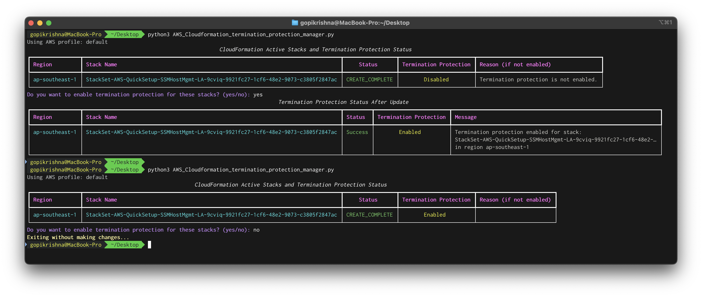

# CloudFormation Stack Termination Protection Manager

This script helps you manage **CloudFormation stack termination protection** across all AWS regions for active stacks. It retrieves active stacks, displays their termination protection status, and optionally enables termination protection for stacks that do not have it enabled.


## Features
- Lists **active CloudFormation stacks** across all AWS regions.
- Checks the **termination protection status** of each stack.
- Displays the results in a clear, tabular format using [Rich](https://github.com/Textualize/rich).
- Allows you to enable termination protection interactively for stacks that do not have it enabled.


## Requirements
- Python 3.7+
- AWS credentials configured using a profile in the AWS CLI.
- Necessary IAM permissions:
  - `cloudformation:ListStacks`
  - `cloudformation:DescribeStacks`
  - `cloudformation:UpdateTerminationProtection`
  - `ec2:DescribeRegions`


## Installation
1. Clone the repository or save the script to your local machine.
2. Install the required Python dependencies:
   ```bash
   pip install boto3 rich
   ```


## Usage

### Command-Line Arguments
- `--profile`: (Optional) AWS CLI profile name to use. Defaults to `default`.

### Example Command

	python3 AWS_Cloudformation_termination_protection_manager.py --profile my-aws-profile

---

## Script Workflow
1. **Retrieve AWS Regions**:
   - The script queries all available AWS regions for the specified profile.
2. **List Active Stacks**:
   - Stacks with the statuses `CREATE_COMPLETE`, `UPDATE_COMPLETE`, or `ROLLBACK_COMPLETE` are considered active.
3. **Check Termination Protection**:
   - The script checks if termination protection is enabled for each active stack.
4. **Display Stacks**:
   - A table is displayed showing the stack names, regions, statuses, and termination protection status.
5. **Interactive Update**:
   - The script prompts you to enable termination protection for stacks that do not have it enabled.
6. **Apply Changes**:
   - If confirmed, termination protection is enabled for applicable stacks, and the results are displayed in a table.


## Output
The script uses the [Rich library](https://github.com/Textualize/rich) to display data in visually appealing tables. Example outputs include:



## Notes
- Ensure your AWS CLI profile is correctly configured with valid credentials.
- Test the script in a non-production environment before applying changes to production stacks.
- The script requires sufficient IAM permissions to interact with CloudFormation.


## Troubleshooting
- **Error: Unable to fetch regions**:
  - Ensure your AWS credentials are valid and have the `ec2:DescribeRegions` permission.
- **Error: Failed to enable termination protection**:
  - Check if the stack is accessible and that you have `cloudformation:UpdateTerminationProtection` permission.