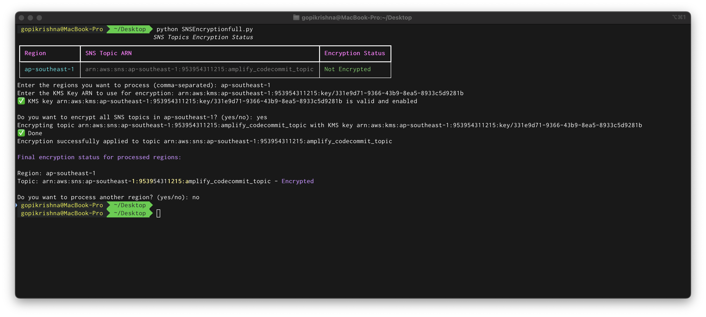

# AWS SNS Topic Encryption Checker

## Description

This Python script helps manage encryption for Amazon SNS (Simple Notification Service) topics across multiple AWS regions. It allows users to easily view encryption status of all SNS topics and enable encryption using AWS KMS (Key Management Service) keys.

## Features

- Lists all SNS topics across AWS regions with their current encryption status
- Validates KMS keys before applying encryption
- Supports both bulk and selective topic encryption
- Provides real-time verification of encryption status
- Offers multi-region support
- Displays results in a clean, formatted table
- Includes comprehensive error handling

## Prerequisites

- Python 3.x
- AWS credentials configured (either via AWS CLI or environment variables)
- Required permissions:
  - SNS: ListTopics, GetTopicAttributes, SetTopicAttributes
  - KMS: DescribeKey
  - EC2: DescribeRegions
- Required Python packages:

## Installation

1. Clone the repository or download the script
2. Install required packages:
3. Ensure AWS credentials are properly configured

## Usage

1. Run the script:

2. The script will:

- Display a table of all SNS topics and their encryption status
- Prompt for regions to process
- Request a KMS key ARN for encryption
- Validate the KMS key
- Allow selection of topics to encrypt
- Verify and display encryption results

## Interactive Prompts

The script will ask for:

- Regions to process (comma-separated)
- KMS key ARN
- Whether to encrypt all topics in a region or select specific ones
- Number of topics to encrypt (if not encrypting all)
- Specific topic ARNs to encrypt (if selecting individual topics)

## Example Output

## Error Handling

The script includes handling for:

- Invalid KMS key ARNs
- Disabled or invalid KMS keys
- Permission issues
- Invalid topic ARNs
- Failed encryption attempts

## Security Features

- KMS key validation before encryption
- Post-encryption verification
- No hardcoded credentials
- Secure error handling

## Best Practices

1. Always verify the KMS key ARN before proceeding
2. Ensure proper IAM permissions are in place
3. Review encryption status after completion
4. Use different KMS keys for different environments/regions if required

## Limitations

- Processes topics sequentially
- Requires manual input for topic selection
- AWS API rate limiting may affect large-scale operations

## Contributing

Feel free to submit issues, fork the repository, and create pull requests for any improvements.

## Disclaimer

This tool is provided as-is. Always test in a non-production environment first.
