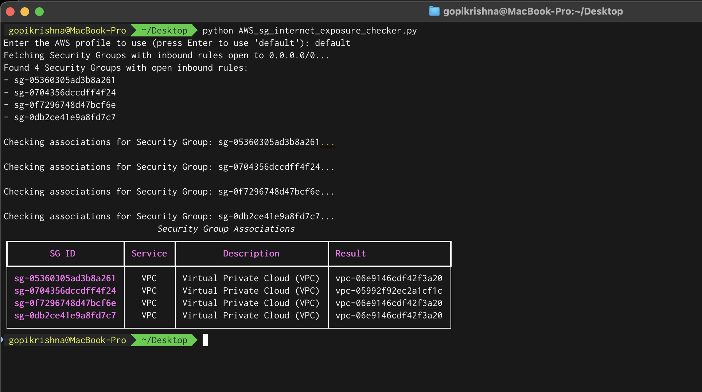

## AWS Security Group Internet Exposure Checker
A Python script that identifies and analyzes AWS Security Groups with inbound rules open to the internet (0.0.0.0/0) and their associated AWS resources.

### Description
This tool helps security teams and AWS administrators identify potentially risky security group configurations by:

* Finding security groups with inbound rules open to 0.0.0.0/0
* Checking which AWS resources are using these security groups
* Providing a clear, tabulated output of findings

### Features
* Scans for security groups with internet-exposed inbound rules
* Checks associations with multiple AWS services:

	* EC2 instances
	* RDS databases
	* ECS tasks
	* EKS clusters
	* Classic Load Balancers
	* VPC associations 
	* ElastiCache clusters
	* MemoryDB clusters

* Presents results in a formatted table using the rich library

### Prerequisites
* Python 3.x
* AWS credentials configured
* Required Python packages:

> boto3  
> rich

### Installation
1. Clone this repository or download the script
1. Install required packages:

> pip install boto3 rich

### Configuration
Ensure you have AWS credentials configured either through:

* AWS CLI ( `aws configure`)
* AWS credentials file ( `~/.aws/credentials`)
* Environment variables

### Usage
Run the script:

	python3 AWS_sg_internet_exposure_checker.py

When prompted, enter your AWS profile name or press Enter to use the default profile.

### Output
The script will:

* List all security groups with open inbound rules
* Display a table showing:

	* Security Group IDs
	* Associated AWS services
	* Service descriptions
	* Resource identifiers

### Security Considerations
This tool is designed for security auditing purposes. Use it to:

* Identify potential security risks
* Validate security group configurations
* Ensure compliance with security policies
* Track internet-exposed resources

### Contributing
Feel free to submit issues, fork the repository, and create pull requests for any improvements.
