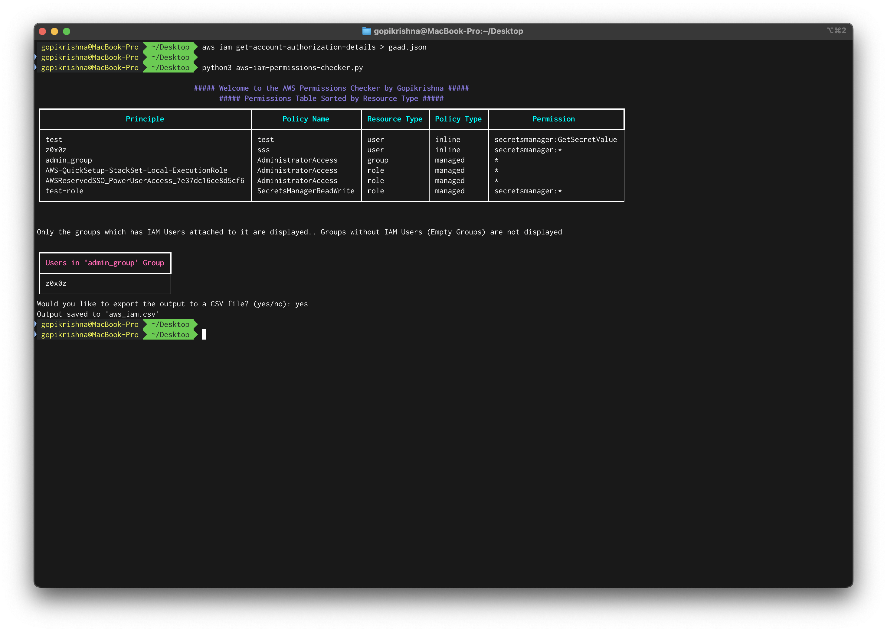
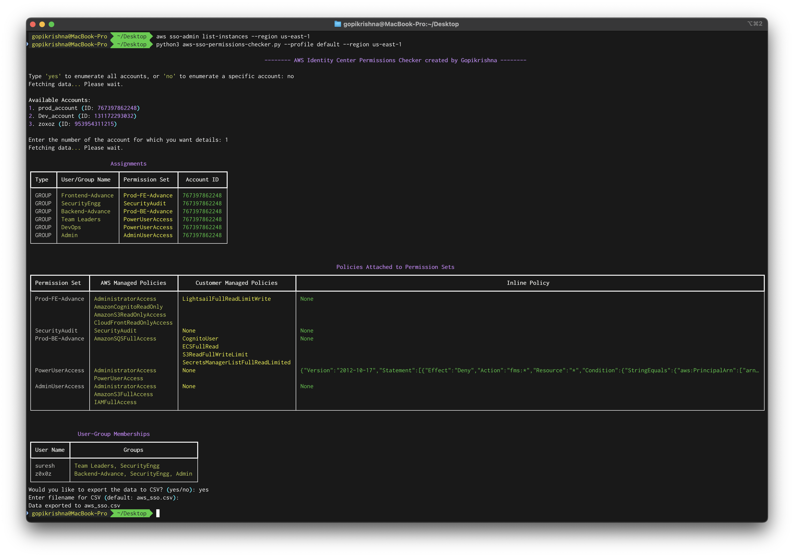

# AWS-Security
This repository consists of AWS Security Scripts useful during Cloud Penetration testing

---

## AWS IAM Permissions Checker

### Description

This script is to find "Which permissions are assigned to Whom in an AWS account".  
The script processes AWS IAM permissions data to generate two main tables:

1. **The Main Permissions Table** detailing users, groups, roles and their associated permissions.
1. **Users in Group Table** for each IAM group with matching permissions, listing the users within that group.  

The script outputs the tables in the console using rich formatting and provides an option to export both tables into a single CSV file.

### Usage

#### Prerequisites
- Python 3.x
- `rich` library for displaying output as table  
  ```
  pip install rich
  ```

#### Running the Script

1. **Prepare the Input File**:
	- Configure the AWS CLI with credentials to perform gaad analysis using the following command
	``` aws iam get-account-authorization-details --profile Chuma > gaad.json ```

2. **Execute the Script**:

	- Mention the permissions to look for inside the script in line number 24
		> Example  
		> exact_permissions = {"iam:*", "secretsmanager:GetSecretValue"}    
		> prefix_permissions = {"secretsmanager:","s3:"}


   - Run the script in the terminal  
     ```
     python aws-iam-permissions-checker.py
     ```

1. **Export to CSV**:
   - When prompted with `Would you like to export the output to a CSV file? (yes/no):`, enter `yes` to save the output to a CSV file.
   - The output will be saved to `aws_iam.csv` in the same directory.
	- The output CSV file, named aws_iam.csv, will contain the Main Permissions Table followed by each Users in Group Table. Each group table is separated by a blank line for clarity.



---

## AWS SSO Permissions Checker

### Description

This script is to find "Which permission set and policies are assigned to Which Idenity center user in an AWS account".  
The script processes AWS SSO permission set data to generate three main tables:

1. **Assignments for Selected Account** detailing users & groups and their associated permission set and account.
1. **Policies Attached to Permission Sets** detailing all the policies attached to the permission set.  
1. **User-Group Memberships** detailing users and their associated Groups. 

The script outputs the tables in the console using rich formatting and provides an option to export all the three tables into a single CSV file.

### Usage

#### Prerequisites
- Python 3.x
- `rich` library for displaying output as table  
  ```
  pip install rich
  ```

#### Running the Script

1. **Instance ARN and Identity Store Id requirement**:
	- Configure the AWS CLI with credentials to get Instance ARN and Identity Store Id using the following command  
	``` aws sso-admin list-instances --region us-east-1 --profile demo ```
	
2. **Execute the Script**:

	- Mention the Instance ARN and Identity Store Id inside the script in line number 31
		> Example  
		> INSTANCE_ARN = "arn:aws:sso:::instance/ssoins-82103ec1ef565d50"  
		> IDENTITY_STORE_ID = "d-96677863a4"


   - Run the script in the terminal  
     ```
     python aws-sso-permissions-checker.py
     ```
  
1. **Export to CSV**:
   - When prompted with `Would you like to export the output to a CSV file? (yes/no):`, enter `yes` to save the output to a CSV file.
   - The output will be saved to `aws_sso.csv` in the same directory.
	- The output CSV file, named aws_sso.csv, will contain all the three tables. Each table is separated by a blank line for clarity
	
	